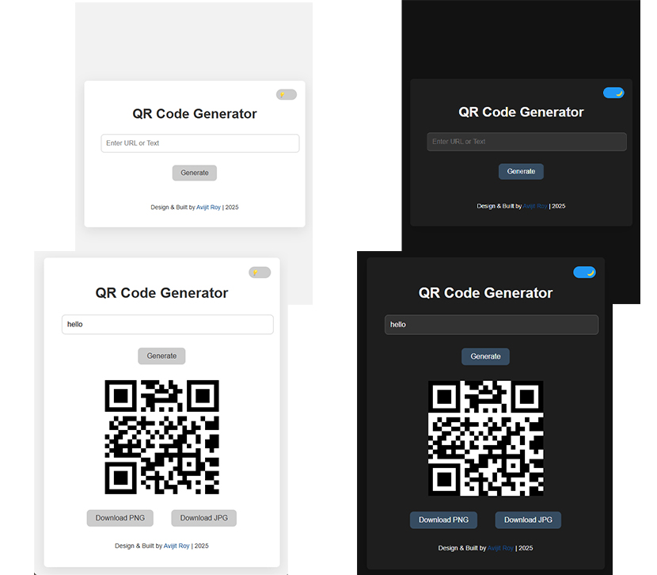

# ➡ [QR Code Generator](https://royavi21.github.io/QR_Code_Generator/)

A sleek and simple **QR Code Generator** built with HTML, CSS, and JavaScript. Instantly create QR codes for any text or URL input. Includes light/dark theme toggle, download options, and a smooth loading animation with a custom logo.

## 🚀 Features

- ✅ Generate QR codes instantly
- 🎨 Light/Dark mode toggle with animated icons (💡 / 🌙)
- ⬇️ Download QR code as PNG or JPG
- 🌀 Custom loading animation using `qr-icon.png`
- 📱 Fully responsive and clean UI

## 📸 Preview

 <!-- Add a screenshot of your app and rename file if needed -->

## 🛠️ Built With

- HTML5
- CSS3 (Flexbox, Animations)
- JavaScript (Vanilla)
- [QRCode.js](https://davidshimjs.github.io/qrcodejs/)

## 📂 Folder Structure

